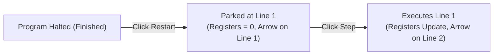

# COE224: Assembly Language Studio — Student Handbook & IDE Guide
**Buraydah Private Colleges — Department of Computer Engineering**  
*Course: COE224 Computer Organization & Assembly Language*  
*Textbook Reference: Kip R. Irvine, "Assembly Language for x86 Processors" (7th/8th Edition)*

---

## Table of Contents
1. [Introduction & Quick Start](#1-introduction--quick-start)
2. [Tour of the Studio (Every Panel & Button Explained)](#2-tour-of-the-studio)
3. [The 2-Step Restart & Debugging Flow](#3-the-2-step-restart--debugging-flow)
4. [CPU Architecture & Register System](#4-cpu-architecture--register-system)
5. [Status Flags & Real-Time Diagnostics](#5-status-flags--real-time-diagnostics)
6. [Memory Segment & Little-Endian Representation](#6-memory-segment--little-endian-representation)
7. [The Runtime Stack & Procedure Calls](#7-the-runtime-stack--procedure-calls)
8. [MASM Directives & Supported Instructions](#8-masm-directives--supported-instructions)
9. [Irvine32 Library Procedures](#9-irvine32-library-procedures)
10. [Classroom Presentation, TV Mode & Mobile Tips](#10-classroom-presentation-tv-mode--mobile-tips)

---

## 1. Introduction & Quick Start

Welcome to **COE224 Assembly Language Studio**! This web-based IDE and architectural simulator is engineered specifically for students learning x86 assembly language. Unlike traditional command-line assemblers (MASM 6.11 or Visual Studio command tools) that execute assembly code opaquely, Assembly Studio allows you to inspect every register, status flag, stack byte, and memory address dynamically as each instruction executes.

### Quick Start: Running Your First Program

```assembly
INCLUDE Irvine32.inc

.data
    val1 DWORD 25
    val2 DWORD 15

.code
main PROC
    mov  eax, val1      ; EAX = 25
    add  eax, val2      ; EAX = 25 + 15 = 40
    call DumpRegs       ; Print registers and flags to console
    exit                ; Terminate execution cleanly
main ENDP
END main
```

1. **Step Execution (`Step`):** Click **Step** to advance instruction by instruction. The yellow pointer (`▶`) indicates which line will execute next.
2. **Continuous Execution (`Run`):** Click **Run** to execute automatically with an animated delay. Click **Pause** at any time.
3. **Step Backward (`Back`):** Over-stepped or missed a flag change? Click **Back** to reverse execution and restore the previous state!
4. **Inspect Results:** Watch register rows glow yellow when their values change, check the status flags box for plain-English explanations, and view your output in the interactive console.

---

## 2. Tour of the Studio

The IDE layout provides a comprehensive view of the underlying computer architecture:

```
┌────────────────────────────────────────────────────────────────────────┐
│                        Top Controls Toolbar                            │
│  [Run] [Step/Restart] [Back] [Reset] | [Examples] [Modules] [Share]    │
├───────────────────┬────────────────────────────────┬───────────────────┤
│    Code Editor    │     CPU Registers & Flags      │    Memory Dump    │
│                   ├────────────────────────────────┼───────────────────┤
│  • MASM syntax    │ • EAX, EBX, ECX, EDX           │ • Hex/ASCII grid  │
│  • Hover Tooltips │ • Sub-registers (AX, AH, AL)   │ • Little-Endian   │
│  • Execution Line │ • Flags: ZF, CF, SF, OF, PF, AF├───────────────────┤
│  • Breakpoints    │ • Live Flag Diagnostics Box    │   Runtime Stack   │
│  • Font Controls  ├────────────────────────────────┼───────────────────┤
│                   │      Interactive Console       │ • ESP & EBP       │
│                   │ • WriteString, ReadInt, Crlf   │ • PUSH / POP      │
└───────────────────┴────────────────────────────────┴───────────────────┘
```

### Toolbar Controls
* **Run / Pause:** Toggles continuous animated execution.
* **Step / Restart:** Advances one instruction. When the program finishes (`exit`) or code is edited, this button automatically changes to **Restart**.
* **Step Backward (Back):** Time-travel undo that reverses the last executed instruction.
* **Reset:** Resets the CPU, registers, stack, and memory back to clean state.
* **Lecture Examples:** Pre-loaded, fully working programs matching Irvine Chapters 1 to 7.
* **Share Link:** Encodes your code into a shareable URL. Great for sending code to your professor or study group!
* **Speed Slider:** Adjusts execution speed from fast (50ms) to slow (1500ms for classroom demos).
* **Handbook:** Opens the in-app interactive documentation.
* **Settings:** Access preferences and the **"Restore Clean Slate"** factory reset.

---

## 3. The 2-Step Restart & Debugging Flow

Assembly Studio implements a **predictable 2-step restart flow** designed for pedagogical clarity:



1. **Press 1 ("Restart"):**
   * Resets all registers back to `0`, clears memory, and points the yellow pointer (`▶`) at **Line 1**.
   * **Line 1 is NOT executed yet.** This ensures you have 100% visibility into the initial register state before any instruction touches them.
   * The button label changes to **"Step"**.
2. **Press 2 ("Step"):**
   * Executes Line 1, updates registers, and advances the pointer to Line 2.

### Stale Code Awareness
If you edit code while paused mid-program or after the program has finished:
* **Registers remain frozen on screen:** You can reference the previous run's values while writing your fix.
* **Header shows `⚠ Modified • Click Restart`:** Warns you that on-screen numbers belong to the previous compilation.
* **Execution line dims with a dashed border:** Shows frozen state.
* **Clicking "Restart" re-compiles the fix** and parks at Line 1 of your new code.

---

## 4. CPU Architecture & Register System

The simulator models the 32-bit x86 Intel IA-32 architecture:

### 32-bit General-Purpose Registers
* **`EAX` (Extended Accumulator):** Primary register for arithmetic calculations and return values.
* **`EBX` (Extended Base):** Base pointer for memory addressing.
* **`ECX` (Extended Counter):** Loop counter used automatically by `LOOP`, `LOOPE`, and string operations.
* **`EDX` (Extended Data):** I/O pointer and high-order product/dividend in multiplication and division.

### Sub-Register Hierarchy
Each 32-bit general-purpose register contains smaller 16-bit and 8-bit partitions:

```
┌───────────────────────────────── EAX (32 bits) ─────────────────────────────────┐
│              High 16 bits              │               AX (16 bits)             │
│                                        │       AH (8 bits)   │    AL (8 bits)   │
└────────────────────────────────────────┴─────────────────────┴──────────────────┘
```

* **Example:** Writing `mov ax, 1234h` into `EAX = 00000000h` produces `EAX = 00001234h`.
* **Example:** Writing `mov ah, 56h` updates only bits 8–15, leaving `AL` untouched!
* *Tip:* Click the arrow next to any register in the Registers panel to view its `AX`, `AH`, and `AL` breakdown!

### Pointer & Index Registers
* **`ESP` (Extended Stack Pointer):** Points to the top of the runtime stack (lowest address).
* **`EBP` (Extended Base Pointer):** Points to the base of the current stack frame.
* **`ESI` (Source Index):** Memory source pointer for block copy and string procedures.
* **`EDI` (Destination Index):** Memory destination pointer.
* **`EIP` (Instruction Pointer):** Contains the address of the next instruction to execute.

---

## 5. Status Flags & Real-Time Diagnostics

Status flags in the `EFLAGS` register record the outcome of arithmetic and logical operations:

| Flag | Name | When is it set to 1? | Example |
| :---: | :--- | :--- | :--- |
| **ZF** | Zero Flag | When the result of an operation is **zero**. | `mov eax, 5` followed by `sub eax, 5` ➔ `ZF = 1` |
| **CF** | Carry Flag | When an **unsigned** operation carries out of MSB or borrows. | `mov al, 255` followed by `add al, 1` ➔ `CF = 1` |
| **SF** | Sign Flag | When the highest bit is 1 (negative signed value). | `mov eax, 2` followed by `sub eax, 5` ➔ `SF = 1` |
| **OF** | Overflow Flag | When a **signed** operation exceeds the register capacity. | `mov al, 127` followed by `add al, 1` ➔ `OF = 1` |
| **PF** | Parity Flag | When the lowest byte of the result has an **even** number of 1-bits. | `mov al, 3` (binary `00000011b`) ➔ `PF = 1` |
| **AF** | Auxiliary Flag | When there is a carry out of bit 3 into bit 4 (BCD arithmetic). | `mov al, 0Fh` followed by `add al, 1` ➔ `AF = 1` |

> [!NOTE]
> Beneath the status flags, the **Live Diagnostics Box** explains in plain English *why* each flag changed (e.g., *"ADD resulted in unsigned carry: CF=1; result non-zero: ZF=0"*).

---

## 6. Memory Segment & Little-Endian Representation

Variables declared in the `.data` segment are placed contiguously in virtual RAM:

### Data Directives
```assembly
.data
    bVal   BYTE  12h, 34h, 56h
    wVal   WORD  1000h
    dVal   DWORD 12345678h
    msg    BYTE  "Hello, COE224!", 0
    arr    DWORD 5 DUP(0)
```

### Little-Endian Byte Ordering
x86 processors store multi-byte integers in memory with the **least significant byte at the lowest memory address**:

* A 32-bit `DWORD` with value `12345678h`:
  * Byte 0 (`offset + 0`): `78h`
  * Byte 1 (`offset + 1`): `56h`
  * Byte 2 (`offset + 2`): `34h`
  * Byte 3 (`offset + 3`): `12h`
* The Memory Dump panel displays the raw bytes in order and provides an ASCII translation column on the right.

---

## 7. The Runtime Stack & Procedure Calls

The runtime stack is an inverted memory structure that grows **downward** (from high memory to low memory):

* **Initial State:** `ESP = 00010000h`.
* **`PUSH operand`:**
  1. Decrements `ESP` by 4 (`ESP = ESP - 4`).
  2. Writes the 32-bit operand to memory at address `[ESP]`.
* **`POP operand`:**
  1. Reads the 32-bit value from memory at address `[ESP]`.
  2. Increments `ESP` by 4 (`ESP = ESP + 4`).
* **`CALL procedure`:** Pushes the return address (the next instruction's address) onto the stack and jumps to the procedure.
* **`RET`:** Pops the return address off the stack and jumps back to the caller.

---

## 8. MASM Directives & Supported Instructions

### Basic Syntax Rules
1. Instructions are not case-sensitive: `MOV eax, 1` is identical to `mov EAX, 1`.
2. Comments begin with a semicolon `;`.
3. String literals must end with a null terminator `, 0` when used with `WriteString`.

### Core Instruction Set
* **Data Movement:** `MOV`, `XCHG`, `PUSH`, `POP`, `LEA`, `OFFSET`.
* **Arithmetic:** `ADD`, `SUB`, `INC`, `DEC`, `NEG`, `MUL`, `IMUL`, `DIV`, `IDIV`.
* **Bitwise Logic:** `AND`, `OR`, `XOR`, `NOT`, `TEST`.
* **Shifts & Rotates:** `SHL`, `SHR`, `SAL`, `SAR`, `ROL`, `ROR`.
* **Comparisons & Conditional Jumps:**
  * `CMP op1, op2`: Subtracts `op2` from `op1`, sets flags, and discards the result.
  * `JE` / `JZ`: Jump if Equal (Zero).
  * `JNE` / `JNZ`: Jump if Not Equal.
  * Signed: `JG` (Greater), `JL` (Less), `JGE`, `JLE`.
  * Unsigned: `JA` (Above), `JB` (Below), `JAE`, `JBE`.
* **Loops:** `LOOP target`: Decrements `ECX`; if `ECX != 0`, jumps to target.
* **Procedures:** `CALL target`, `RET`.

---

## 9. Irvine32 Library Procedures

The Irvine32 library (included automatically via `INCLUDE Irvine32.inc`) simplifies console input and output:

| Procedure | Parameters / Register Usage | Description |
| :--- | :--- | :--- |
| **`WriteString`** | `EDX = OFFSET string` | Displays a null-terminated string to the console. |
| **`WriteInt`** | `EAX = integer` | Displays a 32-bit signed integer with leading sign (`+` or `-`). |
| **`WriteDec`** | `EAX = integer` | Displays a 32-bit unsigned decimal integer. |
| **`WriteHex`** | `EAX = integer` | Displays a 32-bit hexadecimal number. |
| **`WriteBin`** | `EAX = integer` | Displays a 32-bit binary number in 4-bit groups. |
| **`WriteChar`** | `AL = ASCII character` | Displays a single ASCII character. |
| **`Crlf`** | *(None)* | Outputs a carriage return / line feed (new line). |
| **`ReadInt`** | Returns integer in `EAX` | Prompts user for a 32-bit signed integer via keyboard. |
| **`ReadString`** | `EDX = OFFSET buffer`, `ECX = max size` | Prompts user for string input. |
| **`DumpRegs`** | *(None)* | Prints a complete snapshot of all registers and status flags. |
| **`DumpMem`** | `ESI = address`, `ECX = count`, `EBX = size` | Dumps a formatted memory block to the console. |

---

## 10. Classroom Presentation, TV Mode & Mobile Tips

* **Classroom TV Mode (140% – 200% Zoom):** Click **TV Mode** in the header or use the zoom buttons to scale the entire interface up for classroom projectors and lecture hall displays.
* **Mobile & Tablet Bottom Tabs:** On mobile devices, bottom tabs let you easily switch between **Code**, **Registers**, **Memory**, and **Console**. The console tab displays a notification badge when new output is printed.
* **Restore Clean Slate (Factory Reset):** If you ever want to wipe saved browser code and restore default settings, open **Settings** (gear icon) and click **Reset All to Clean Slate** in the danger zone.
